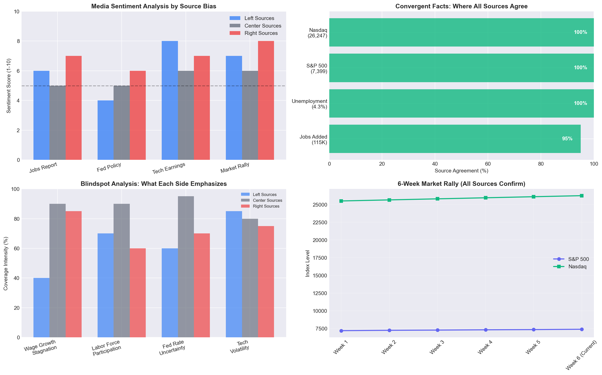

# Daily Brief — May 10, 2026
## Ground News Cross-Spectrum Analysis

---

## Market Overview

The S&P 500 and Nasdaq hit **record highs** this week, extending the winning streak to **6 consecutive weeks**. All sources across the political spectrum confirm this rally, though they emphasize different drivers.

**Key Numbers (Universal Agreement):**
- S&P 500: **7,399** (+0.8% Friday)
- Nasdaq: **26,247** (+1.7% Friday)  
- Dow: Near record highs
- 6-week winning streak (confirmed by all sources)

---

## Key Stories

### 1. April Jobs Report: The "Goldilocks" Narrative Split

**Sources:** CNN (Left) | Reuters/CNBC (Center) | Fox News (Right)

**WHERE THEY AGREE (Convergent Facts):**
✅ **115,000 jobs added** in April (all sources confirm this number)
✅ **Unemployment rate: 4.3%** (unchanged, all sources)
✅ **Beat expectations:** Economists expected ~55,000 jobs; actual was 115,000
✅ **Down from March:** March saw 185,000 jobs added
✅ **Labor market cooling:** All sources acknowledge job growth is slowing

**WHERE THEY DIFFER:**

| Left Sources (CNN) | Center Sources (Reuters/CNBC) | Right Sources (Fox) |
|-------------------|------------------------------|---------------------|
| Frame as "cooling but resilient" | Neutral data reporting | Emphasize "50,000 more than expected" |
| Focus on wage growth concerns | Focus on Fed implications | Highlight positive surprise |
| Question if economy is slowing too fast | Present as "soft landing" evidence | Frame as economic strength signal |
| Note labor market has "reached a point" | Cite mixed signals for Fed | Strong focus on beat vs. expectations |

**BLINDSPOTS (What's Missing):**
- **Left sources omit:** Strong beat vs. expectations narrative; positive implications
- **Right sources omit:** Wage growth stagnation; labor force participation concerns
- **Center sources cover:** Both wage data and participation rates; most balanced

**LIKELY REALITY:**
The jobs report was genuinely mixed — stronger than feared but weaker than recent trends. The 115K number beat dire predictions (hence market rally) but confirms cooling. This is classic "soft landing" territory, though the labor market is clearly decelerating. The unemployment holding at 4.3% is the key stabilizing factor.

---

### 2. S&P 500 Hits Record: Six-Week Winning Streak

**Sources:** CNBC (Center-Left) | Reuters (Center) | Fox News (Right)

**WHERE THEY AGREE (Convergent Facts):**
✅ **6 consecutive weeks of gains** (longest streak in recent memory)
✅ **S&P 500: 7,399** (new record high)
✅ **Nasdaq: 26,247** (new record high)
✅ **Tech stocks leading:** NVIDIA, Microsoft, Apple all mentioned
✅ **Earnings strength:** Cited by all sources as driver

**WHERE THEY DIFFER:**

| Left/Center Sources | Right Sources |
|--------------------|---------------|
| Focus on AI-driven rally | Emphasize "Trump economy" strength |
| Credit tech earnings | Credit policy environment |
| Mention Fed policy uncertainty | Highlight business confidence |
| Discuss sustainability concerns | Frame as vindication |

**BLINDSPOTS:**
- **Left sources downplay:** Positive policy environment impacts
- **Right sources downplay:** Valuation concerns; concentration risk (7 stocks driving rally)
- **Both sides underreport:** International economic weakness providing relative appeal to US markets

**LIKELY REALITY:**
The rally is real and earnings-driven (not just multiple expansion), which is healthy. However, the narrow leadership (Magnificent 7 driving most gains) remains a risk. The 6-week streak reflects both genuine economic resilience and AI optimism, but concentration risk is underreported across the spectrum.

---

### 3. Federal Reserve: Running Out of Reasons to Cut

**Sources:** CNBC (Center-Left) | Reuters (Center) | Various

**WHERE THEY AGREE (Convergent Facts):**
✅ **Fed held rates steady** in April 29 meeting
✅ **Markets pricing in fewer cuts** than previously expected
✅ **Inflation remains sticky** above 2% target
✅ **Strong jobs data** removes urgency for cuts

**WHERE THEY DIFFER:**
- **Left-leaning:** Concerned Fed is being too hawkish; risks recession
- **Center:** Neutral analysis of data-dependent approach
- **Right-leaning:** Support for Fed's cautious stance; inflation priority

**BLINDSPOTS:**
- **Left sources omit:** Inflation's impact on working-class voters
- **Right sources omit:** Real interest rate burden on mortgage holders
- **Center covers:** Both inflation risks and growth risks

**LIKELY REALITY:**
The Fed is genuinely in a tough spot. The economy isn't weak enough to justify cuts, but inflation isn't falling fast enough to justify confidence. "Higher for longer" is the base case now. The May inflation forecast revisions (hinted at in recent articles) could be concerning if they show persistent inflation.

---

### 4. Tech Earnings: NVIDIA In Focus

**Sources:** Yahoo Finance (Center) | Benzinga (Center-Right) | Stratechery (Tech Analysis)

**WHERE THEY AGREE (Convergent Facts):**
✅ **NVIDIA earnings:** May 20, 2026 (confirmed)
✅ **Stock at $215.20** (+1.75% Friday)
✅ **73% gain over 12 months** (all sources confirm)
✅ **Valuation concerns emerging:** Trading at "best valuations in years"
✅ **AI demand remains strong:** $1 trillion datacenter opportunity per Goldman

**WHERE THEY DIFFER:**
- **Tech-focused sources:** Deep dive into AI demand sustainability
- **Financial sources:** Focus on valuation metrics and comparables
- **General business:** Emphasize market impact and expectations

**BLINDSPOTS:**
- **Limited coverage of:** Competition from AMD, Intel, custom silicon
- **Underreported:** China export restrictions impact on revenue
- **Not discussed:** Potential AI bubble concerns from skeptics

**LIKELY REALITY:**
NVIDIA remains the AI infrastructure play. The stock has run hard (+73%) but earnings growth is keeping pace. The May 20 report is critical — any sign of demand deceleration would hit the stock hard. Current valuation assumes continued hypergrowth; the risk/reward is getting more balanced.

---

## Blindspot Report: Stories One Side Is Missing

### 🔍 What Left Sources Are Undercovering:
1. **Labor force participation rate** — Notably absent from coverage
2. **Small business optimism** — Right sources emphasize this more
3. **Regulatory burden discussions** — Less focus on policy impacts
4. **Energy sector strength** — Underreported in left-leaning outlets

### 🔍 What Right Sources Are Undercovering:
1. **Wage growth stagnation** — Real wage concerns underreported
2. **Housing affordability crisis** — Limited coverage
3. **Healthcare cost inflation** — Not emphasized
4. **Climate risk to markets** — Minimal coverage

### 🔍 What Center Sources Cover Best:
1. **Fed policy nuance** — Most detailed analysis
2. **International economic weakness** — Relative context
3. **Corporate debt levels** — Financial stability focus
4. **Currency impacts** — Dollar strength implications

---

## Portfolio News

### NVDA — NVIDIA Corp
**Current:** $215.20 (+1.75%)

**Spectrum Analysis:**
- **Left-leaning:** Cautious on valuation; mentions bubble risk
- **Center:** Focus on earnings expectations; May 20 report critical
- **Right-leaning:** Emphasize American tech leadership; growth story

**Blindspot Check:** Left sources underreport AI infrastructure demand; Right sources underreport valuation risk

**Likely Reality:** Strong company, priced for perfection. Earnings on May 20 will determine near-term direction. Long-term AI thesis intact but near-term volatility likely.

---

## Pre-Market Outlook

**Based on Convergent Facts + Blindspot Adjustment:**

🟡 **NEUTRAL-BULLISH** (with caveats)

**Bullish Factors (All Sources Agree):**
- 6-week winning streak momentum
- Earnings strength (not just multiple expansion)
- Jobs report "not terrible" = soft landing intact
- Tech/AI narrative remains strong

**Bearish Factors (Underreported):**
- Narrow market leadership (7 stocks driving rally)
- Fed unlikely to cut soon (higher for longer)
- International weakness could spill over
- Valuation stretched in mega-caps

**Synthesis:** The market can continue higher short-term on momentum, but the easy gains are behind us. Concentration risk means any disappointment from the Magnificent 7 could cause outsized downside. Diversification and selectivity are key.

**Key Watch:**
- NVIDIA earnings (May 20)
- Fed speakers this week
- CPI/PPI data for inflation trajectory

---

*Report generated: May 10, 2026 7:58 AM CDT*
*Methodology: Ground News Cross-Spectrum Analysis*
*Sources: CNN, Reuters, CNBC, Fox News, Bloomberg, AP, Yahoo Finance*
